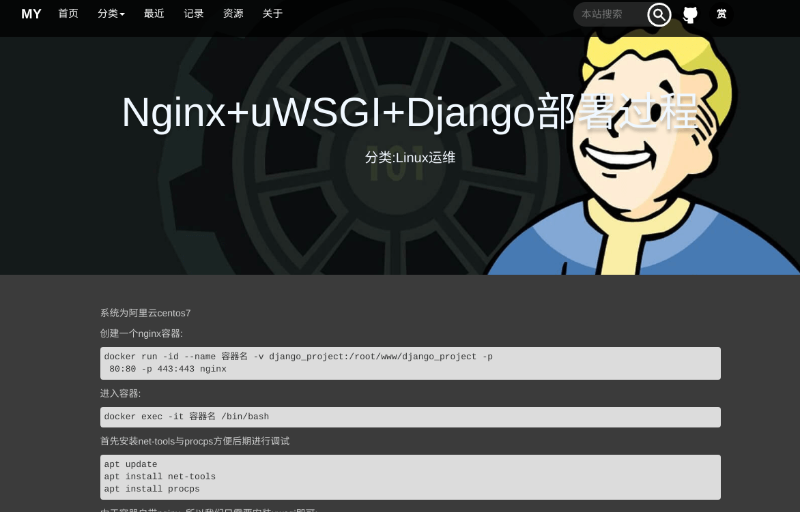

# 一个基于Django的博客
仅支持基本博客功能，没有任何扩展
**ps:由于写的烂到辣眼睛，早已经不继续写了**
## 预览


## 测试
确保python3环境
缺啥包就安啥，看着办吧
数据库搞一下：
```
python3 manage.py  migrate
python3 manage.py  makemigrations
```
开server
```
python3 manager.py runserver
```
改完报错就OK了(o゜▽゜)o☆
## 部署过程（此处使用Docker+Nginx+uWSGL+Django）可以当教程看看
1. 创建一个nginx容器:
```
docker run -id --name 容器名 -v django_project:/root/www/django_project -p 80:80 -p 443:443 nginx
```
2. 进入容器:
```
docker exec -it 容器名 /bin/bash
```
3. 安装net-tools与procps方便后期进行调试
```
apt update
apt install net-tools
apt install procps
```
4. 由于容器自带nginx, 所以我们只需要安装uwsgi即可:
   1. 首先确保容器内有pip3, 没有自行安装
    ```
        apt install python3-pip
    ```
   2. 直接安装uwsgi
    ```
    pip3 install uwsgi
    ```
5. 开始配置:
    1. 在项目根目录创建uwsgi配置文件
    ```
    vim uwsgi.ini
    ```
    2. 根据需求写入
```
[uwsgi]
chdir = your_project_dir
module = your_project.wsgi:application #此处的wsgi模块根据你的项目wsgi位置进行配置
master = True
processes = 4
max-requests = 5000
harakiri = 60
socket = 127.0.0.1:8848			#设置监听端口
daemonize =  your_project_dir/mysite.log	#设置log位置
vacuum = True
threads=2
pidfile=uwsgi.pid
```
处理注释的地方, 其他的可以保持不变, 需要的话可以戳这里, 查看全部参数意义
6. 开启一下: 
```
uwsgi --ini uwsgi.ini
```
出现这个提示就表示开启成功, 可以cat 一下.log查看日志

有的人可能会报这个错:Internal Server Error
可以检查一下自己的django项目是否有未安装的包存在, 只要包安装正确理论上就没有问题了
7. 配置nginx:
在/etc/nginx/conf.d下新建一个自己的配置文件:
如: project.conf
```
upstream django {
# server unix:///path/to/your/mysite/mysite.sock; # for a file socket
server 127.0.0.1:8848;	//此处的端口是uwsgi监听的端口
}

server {

listen   80;  
server_name  blog;  
charset UTF-8;

client_max_body_size 75M;

location / {
uwsgi_pass 127.0.0.1:8848;
include /etc/nginx/uwsgi_params;
}
location /static {				
alias project_path/STATIC_URL;	#静态资源路(此处的STATIC_URL,需要替换为settings中的STATIC_URL, 下面的MEDIA_ROOT同
}
location /media {
alias project_path/MEDIA_ROOT; #上传资源路径
}
}
```
8. 在nginx.conf中引入
`include /etc/nginx/conf.d/project.conf;`
完成, 直接访问就可以了

9. 有兴趣可以继续配置https
首先获取个SSL证书:
阿里云的点这里:https://yundun.console.aliyun.com/?spm=5176.12901015.0.i12901015.1398525c1Nfqeu&p=cas#/overview/cn-hangzhou
然后把证书下载传到服务器, 传到docker内部
解压
放到nginx配置目录(/etc/nginx/cert)目录下(没有cert目录自己创建)
配置刚才的project.conf
修改为以下:
```
upstream django {
# server unix:///path/to/your/mysite/mysite.sock; # for a file socket
server 127.0.0.1:8848;
}

server {
listen 80;
server_name kilic.site ;
rewrite ^(.*)$ https://$host$1 permanent;#自动转发https请求
}

server {
listen  443 ssl;  
server_name  kilic.site;  
charset UTF-8;
client_max_body_size 75M;
ssl_certificate cert/xxx.pem;	#此处为自己的证书名
ssl_certificate_key cert/xxx.key;	#此处为自己的私钥
ssl_ciphers ECDHE-RSA-AES128-GCM-SHA256:ECDHE:ECDH:AES:HIGH:!NULL:!aNULL:!MD5:!ADH:!RC4;
ssl_protocols TLSv1 TLSv1.1 TLSv1.2;
ssl_prefer_server_ciphers on;
location / {
uwsgi_pass 127.0.0.1:8848;
include /etc/nginx/uwsgi_params;
}
location /static {
alias /var/www/blog/static/;
}
location /media {
alias /var/www/blog/blog/media/;
}
}
```
重启nginx:
`nginx -s reload`

以上
